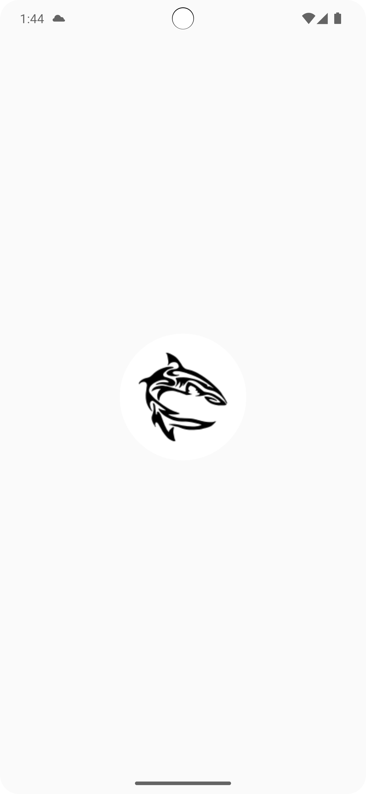
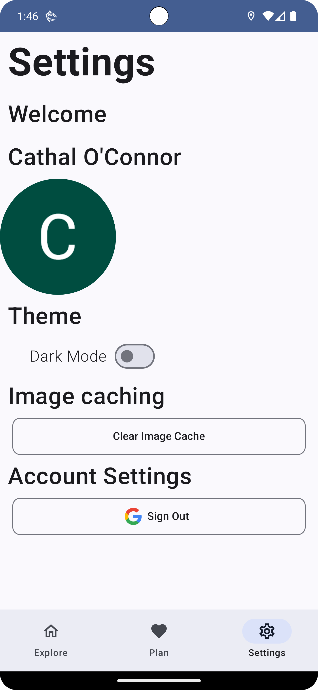

# Mobile App Development
# Project Name: Sound Safari
## Project Description:
Sound safari is a mobile application that allows users to create a customised GPS based audio tour. A user signs up and saves locations to visit, once they enter a geofenced location an audio prompt plays with the details about the location they are visiting. 

### The following technologies have been used in the making of the sound safari mobile application:
* Kotlin
* Jetpack Compose
* Android Studio
* Git/GitHub
* Firebase Realtime Database
* Firebase Authentication
* Google Authentication
* Google Maps API
* Android text to speech
* Tripadvisor api
* Timber for logging

## Features
* CRUD functionality for locations, locations are persisted to Firebase Realtime Database.
* User authentication using Firebase Authentication and Google Authentication. A user can choose whether to sign authenticate using their google account or skip and an anonymous user will be created for them in firestore. When they authenticate fully later the user data will be merged. 
* App navigation via Bottom bar navigation.
* Map functionality to allow the user to see each individual location and also to show all saved locations together on one map. This allows the user to see possible destinations and see all selected destinations in relation to each other. The map functionality makes use of the 
Google Maps API.
* Swipe left to delete support for saved locations.
* Night mode functionality.
* A foreground service with persistent notification is used to poll the GPS location of the user for triggering the audio TTS when entering the geofence. This currently polls every second for testing within the emulator but can be adjusted for production version. 
* A boot receiver service is used to start the foreground service when the device is restarted. 
* A background receiver to receive the geofence event and start the TTS event.  
* Offline cache as part of Coil, Retrofit and Firestore.

## Visuals
### Sign Up & Login Page:

### Sign Up & Login Page:
|Light Mode|Dark Mode|
|:-:|:-:|
|||
### Sign in:
|Light Mode|Dark Mode|
|:-:|:-:|
|||
### Locations Page:
|Light Mode|Dark Mode|
|:-:|:-:|
|||
### Location Details Page:
|Light Mode|Dark Mode|
|:-:|:-:|
|||
### Plan Page:
|Light Mode|Dark Mode|
|:-:|:-:|
|||
### Settings Page:
|Light Mode|Dark Mode|
|:-:|:-:|
|||
### Map View Page:
|Light Mode|Dark Mode|
|:-:|:-:|
|||
### Search Popup:
|Light Mode|Dark Mode|
|:-:|:-:|
|||

## UX/DX
### UX
The app is designed to be as easy to use as possible and uses standard icons to follow industry norms. Text is used on buttons where icons were not enough to convey functionality. The colours scheme is kept simple to ensure ease of use in either light or dark mode. 

### DX
I tried followed The MVVM Design Pattern where necessary. I separated the program logic from the UI functionality once the logic became complicated. Pages such as the settings page aren't separated as the logic is small.
I also tried to follow a clean architecture approach ensuring that the code is neat, with an easy to understand naming convention and formatted correctly. 

## GIT 
Git has 2 branches, Main and dev, with dev storing the work as changes were made and then pull requests created from dev to main for each tagged release. Renovate bot was used to ensure dependencies are kept up to date. A github action runs on every push/pull to main which runs `./gradelw test` and builds the apk. An example of the built artifact is https://github.com/CathalOConnorRH/mobile_app_dev/actions/runs/8909150662

## Personal Statement
This project has taken the longest of any projects so far. A lot of reference material and articles are out of date for Jetpack Compose even if written within the last 12 months. This made figuring out the correct usages tricky in some places and means functionality is not exactly what I would have if it were an actual commercial application. I will update the functionality in future versions to address the issues as I learn more. 

As it currently stands the app works and is usable in the real world. With the addition of additional sources some of the information could be better tailored to the app. One example is the inaccuracy of GPS location data for some locations in tripadvisor. If I had a custom backend to host the data it would be more accurate or at least controllable. There are also limitations of the tripadvisor api that only returns a limited number of results. 
## References
Online articles and tutorials used in the process of developing this app. 

- [How to Integrate Firebase Firestore with Kotlin and Use it in Android Apps](https://www.blog.finotes.com/post/how-to-integrate-firebase-firestore-with-kotlin-and-use-it-in-android-apps)
- [Android Custom Dialog using jetpack compose | by MaKB | Medium](https://makb.medium.com/android-custom-dialog-using-jetpack-compose-954d83e55af7)
- [API Calls with Retrofit in Android Kotlin: A Comprehensive Guide | by Kuldeep Singh Rai | Medium](https://medium.com/@imkuldeepsinghrai/api-calls-with-retrofit-in-android-kotlin-a-comprehensive-guide-e049e19deba9)
- [Work with Firebase Realtime database lists | by PRANAY PATEL | Medium](https://pranaypatel.medium.com/work-with-firebase-realtime-database-lists-215f4e988cf4)
- [Create and monitor geofences  |  Sensors and location  |  Android Developers](https://developer.android.com/develop/sensors-and-location/location/geofencing)
- [Understanding and Using Services in Android: Background & Foreground Services | by Codeible | Medium](https://medium.com/@Codeible/understanding-and-using-services-in-android-background-foreground-services-8130f6bbf2a5)
- [dheeraj-bhadoria/Compose-MVVM-Retrofit-ViewMode-LiveData-Complete-Example-Android-App: Compose MVVM Retrofit ViewMode LiveData Complete Example Android App. How to implement MVVM with Retrofit in compose based android app.](https://github.com/dheeraj-bhadoria/Compose-MVVM-Retrofit-ViewMode-LiveData-Complete-Example-Android-App)
- [Lists using LazyColumn in Jetpack Compose | by Maryam Alhuthayfi | Medium](https://medium.com/@mal7othify/lists-using-lazycolumn-in-jetpack-compose-c70c39805fbc)
- [Jetpack Compose Android App with MVVM Architecture and Retrofit - API Integration | by Dheeraj Singh Bhadoria | Medium](https://medium.com/@dheerubhadoria/jetpack-compose-android-app-with-mvvm-architecture-and-retrofit-api-integration-4eb61ca6fbf2)
- [Compose-MVVM-Retrofit-ViewMode-LiveData-Complete-Example-Android-App/app/src/main/java/com/dheeraj/composemvvm/view/CreditCardScreen.kt at main · dheeraj-bhadoria/Compose-MVVM-Retrofit-ViewMode-LiveData-Complete-Example-Android-App](https://github.com/dheeraj-bhadoria/Compose-MVVM-Retrofit-ViewMode-LiveData-Complete-Example-Android-App/blob/main/app/src/main/java/com/dheeraj/composemvvm/view/CreditCardScreen.kt)
- [Android Compose Tutorial - Profile Card | by Ken Ruiz Inoue | Deuk | Medium](https://medium.com/deuk/intermediate-android-compose-profile-card-6a7e1b9e32b6)
- [Building an Expandable Credit Card Information Card in Jetpack Compose | by Dheeraj Singh Bhadoria | Medium](https://medium.com/@dheerubhadoria/building-an-expandable-credit-card-information-card-in-jetpack-compose-53df3089e360)
- [How to reuse data for previews in Jetpack Compose | by Juan Guillermo Gómez Torres | Google Developer Experts | Medium](https://medium.com/google-developer-experts/how-to-reuse-data-for-previews-in-jetpack-compose-3868ea2c53a)
- [Cards En Jetpack Compose - Develou](https://www-develou-com.translate.goog/cards-en-jetpack-compose/?_x_tr_sl=cs&_x_tr_tl=en&_x_tr_hl=en&_x_tr_pto=wapp)
- [jamesreve/android-jetpack-compose: Ejemplos de la guía de Jetpack Compose de Develou](https://github.com/jamesreve/android-jetpack-compose/tree/main)
- [Send simple data to other apps  |  Android Developers](https://developer.android.com/training/sharing/send)
- [Jetpack Compose Add a Share Button to your App | by Chase | Medium](https://medium.com/@jpmtech/jetpack-compose-add-a-share-button-to-your-app-5f26b7554e94)
- [Card  |  Jetpack Compose  |  Android Developers](https://developer.android.com/develop/ui/compose/components/card#:~:text=elevation%20%3A%20Adds%20a%20shadow%20to,not%20respond%20to%20user%20input.)
- [Navigating with Jetpack Compose. In this article we are going to learn… | by Jayant Kumar🇮🇳 | Medium](https://nameisjayant.medium.com/navigating-with-jetpack-compose-8ee83c32a1b9)
- [Navigation and the back stack  |  Android Developers](https://developer.android.com/guide/navigation/backstack)
- [Navigation with Compose  |  Jetpack Compose  |  Android Developers](https://developer.android.com/develop/ui/compose/navigation#nav-with-args)
- [android - How can i get the response url using Retrofit2 in Kotlin? - Stack Overflow](https://stackoverflow.com/questions/75918799/how-can-i-get-the-response-url-using-retrofit2-in-kotlin)
- [Mastering Data Sharing Between Screens with Jetpack Compose: 5 Key Techniques](https://rhythamnegi.com/mastering-data-sharing-between-screens-with-jetpack-compose-5-key-techniques)
- [Coil Compose — Loading and Caching Images in Compose | by Sudhanshu Kumar | Medium](https://medium.com/@sudhanshukumar04/coil-compose-loading-and-caching-images-in-compose-ebd7b25820c0)
- [Android: How do I get string from resources using its name? - Stack Overflow](https://stackoverflow.com/questions/7493287/android-how-do-i-get-string-from-resources-using-its-name/7493367#7493367)
- [Using String Resources in a ViewModel | by Margin KS | Medium](https://medium.com/@margin555/using-string-resources-in-a-viewmodel-e334611b73da)
- [Basic Android Compose - User Rating Bar | by Ken Ruiz Inoue | Deuk | Medium](https://medium.com/deuk/basic-android-compose-user-rating-bar-6e0990b017f9)
- [Jetpack Compose for Maps | Darryl Bayliss](https://www.darrylbayliss.net/jetpack-compose-for-maps/)
- [Jetpack compose — Load Images from URL | by Csmworks | Medium](https://medium.com/@csmworks1983/jetpack-compose-load-images-from-url-27ca7bf72571)
- [Get data with Cloud Firestore  |  Firebase](https://firebase.google.com/docs/firestore/query-data/get-data)
- [Improve your code with lint checks  |  Android Studio  |  Android Developers](https://developer.android.com/studio/write/lint)
- [landomen/ForegroundService14Sample: Simple sample app demostrating how to use Foreground Services on Android 14.](https://github.com/landomen/ForegroundService14Sample?source=post_page-----9d0127dc8f9a--------------------------------)
- [How to authenticate to Firebase using Google One Tap in Jetpack Compose? | by Alex Mamo | Firebase Developers | Medium](https://medium.com/firebase-developers/how-to-authenticate-to-firebase-using-google-one-tap-in-jetpack-compose-60b30e621d0d)
- [Firebase Authentication in Jetpack Compose: Part 1 - Anonymous Authentication | Medium](https://medium.com/@marwa.diab/firebase-authentication-in-jetpack-compose-part-1-73cb79d3e744)
- [Bottom AppBar with Jetpack Compose | by Abhishek Pathak | Medium](https://medium.com/@myofficework000/bottom-appbar-with-jetpack-compose-59795808eae4)
- [Why Timber for logging and how to implement it in Android? | by Mohd Raghib | Medium](https://medium.com/@raghib.khan76/why-timber-for-logging-and-how-to-implement-it-3f724f874b77)
- [How to create Toast message in Jetpack Compose | Android? | by Sriyank Siddhartha | Smartherd | Medium](https://medium.com/smartherd/how-to-create-toast-message-in-jetpack-compose-android-6144c2749ae0)
- [How to pass object in navigation in jetpack compose? - Stack Overflow](https://stackoverflow.com/questions/67121433/how-to-pass-object-in-navigation-in-jetpack-compose)
- [Request Permissions in Android with Jetpack Compose | Medium](https://medium.com/@cherfaoui_dev/handle-runtime-permissions-in-jetpack-compose-fc678b8b4a62)
- [Google Maps in Jetpack Compose | Make Android](https://medium.com/make-android/exploring-the-world-with-google-maps-in-jetpack-compose-9024e9148782)
- [Jetpack Compose for Maps | Darryl Bayliss](https://darrylbayliss.net/jetpack-compose-for-maps/)
- [How to Request Location Permissions in Jetpack Compose](https://www.freecodecamp.org/news/requesting-location-permissions-in-jetpack-compose/)
- [Android/Kotlin/Jetpack Compose: Popup Window | by Itsuki | Medium](https://medium.com/@2018.itsuki/android-kotlin-jetpack-compose-popup-window-b011cacd9e7d)
- [Swipeable Component with Jetpack Compose | swipe to delete or archive | by Ahmed Khater | Medium](https://medium.com/@khater/swipeable-component-with-jetpack-compose-swipe-to-delete-or-archive-debfe4503613)
- [ExpandableCardCompose/app/src/main/java/com/drsync/expandablecardcompose/MainActivity.kt at master · bennyfajri/ExpandableCardCompose](https://github.com/bennyfajri/ExpandableCardCompose/blob/master/app/src/main/java/com/drsync/expandablecardcompose/MainActivity.kt)
- [Text-to-Speech-And-Speech-to-Text-App/app/src/main/java/com/example/texttospeechspeechtotextapp/MainActivity.kt at master · Coding-Meet/Text-to-Speech-And-Speech-to-Text-App](https://github.com/Coding-Meet/Text-to-Speech-And-Speech-to-Text-App/blob/master/app/src/main/java/com/example/texttospeechspeechtotextapp/MainActivity.kt)
- [Android-Kotlin-Text-To-Speech-Example/app/src/main/java/com/robsonribeiroft/texttospeechexemple/TTS.kt at master · robsonribeiroft/Android-Kotlin-Text-To-Speech-Example](https://github.com/robsonribeiroft/Android-Kotlin-Text-To-Speech-Example/blob/master/app/src/main/java/com/robsonribeiroft/texttospeechexemple/TTS.kt)
- [Geofencing for boost your digital campaign | by Veronica Putri Anggraini | Medium](https://veroanggra.medium.com/geofencing-for-boost-your-digital-campaign-b890afe14dee)

